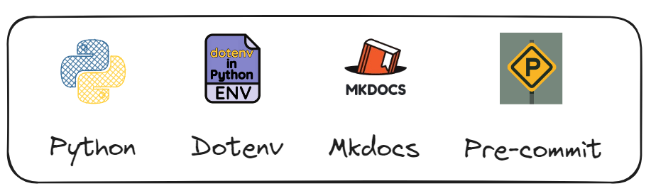

# Project

Description about your project

## Architecture


## Tools
* Python
* Pre-commit
* Mkdocs
* Dot-env

## Pre-requisites
* Python:3.10
* Docker

## How unlock pre-requisites?
* Install Python: https://www.python.org/downloads/

* Install Docker: https://www.youtube.com/playlist?list=PLbPvnlmz6e_L_3Zw_fGtMcMY0eAOZnN-H


## How to use the project?
Clone the repository:
```
git clone https://github.com/wlcamargo/template_python_project
```
Enter the project directory:
```
cd template_python_project
```

## How to use the project?
Create a virtual environment:
```
python3 -m venv venv
```

Activate the virtual environment (Linux):
```
source venv/bin/activate
```

Install the dependencies:
```
pip install -r requirements.txt
```

Run the program:
```
python src/sample_dotenv.py
```

## How to use the documentation?
Run documentation:
```
docker compose up -d
```
Access documentation:
localhost:8005


## References
https://docs.python.org/3/

https://pypi.org/project/python-dotenv/

https://pre-commit.com/

https://www.mkdocs.org/

## Developer
| Desenvolvedor      | LinkedIn                                   | Email                        | Portfólio                              |
|--------------------|--------------------------------------------|------------------------------|----------------------------------------|
| Wallace Camargo    | [LinkedIn](https://www.linkedin.com/in/wallace-camargo-35b615171/) | wallacecpdg@gmail.com        | [Portfólio](https://wlcamargo.github.io/)   |
