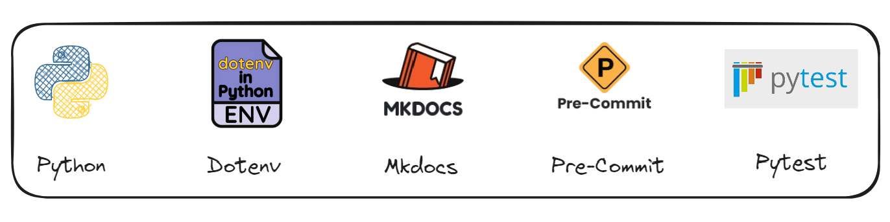

# Project

Description about your project

## Architecture


## Tools
* Python
* Pre-commit
* Mkdocs
* Dot-env
* Pytest

# Tools Overview

This document provides a brief overview of several tools commonly used in Python development, including Pre-commit, Mkdocs, Dot-env, and Pytest.

## Pre-commit

**Pre-commit** is a framework for managing and maintaining Git pre-commit hooks. These hooks are scripts that run automatically before each commit to ensure code quality and enforce consistent coding standards. Pre-commit can be used to automatically run linters, formatters, and other tools on the staged code, preventing bad code from being committed to the repository.

## Mkdocs

**Mkdocs** is a static site generator that's geared towards creating project documentation. It's simple to set up and use, making it ideal for generating beautiful, customizable documentation for Python projects. Mkdocs uses Markdown for writing content and supports themes and plugins to extend its functionality.

## Dot-env

**Dot-env** is a tool that helps manage environment variables in Python projects. It allows developers to define environment-specific variables in a `.env` file and load them into the application. This approach keeps sensitive information, like API keys and database credentials, out of the codebase and makes it easier to switch between different environments (development, testing, production).

## Pytest

**Pytest** is a robust testing framework for Python, designed to make it easy to write simple and scalable test cases. It supports a wide range of testing needs, including unit testing, functional testing, and integration testing. Pytest is known for its simplicity, powerful features, and ability to handle complex testing scenarios with ease.


## Pre-requisites
* Python:3.10
* Docker

## How unlock pre-requisites?
* Install Python: https://www.python.org/downloads/

* Install Docker: https://www.youtube.com/playlist?list=PLbPvnlmz6e_L_3Zw_fGtMcMY0eAOZnN-H

## How to use the project?
Clone the repository:
```
git clone https://github.com/wlcamargo/template_python_project
```
Enter the project directory:
```
cd template_python_project
```

## How to use the project?
Create a virtual environment:
```
python3 -m venv venv
```

Activate the virtual environment (Linux):
```
source venv/bin/activate
```

Install the dependencies:
```
pip install -r requirements.txt
```

Run the program:
```
python src/sample_dotenv.py
```

## How to use the documentation?
Enter the folder:
```
cd docs/
```
Run documentation:
```
docker compose up -d
```
Access documentation:
localhost:8005


## References
https://docs.python.org/3/

https://pypi.org/project/python-dotenv/

https://pre-commit.com/

https://www.mkdocs.org/

https://docs.pytest.org/en/stable/

## Developer
| Desenvolvedor      | LinkedIn                                   | Email                        | Portfólio                              |
|--------------------|--------------------------------------------|------------------------------|----------------------------------------|
| Wallace Camargo    | [LinkedIn](https://www.linkedin.com/in/wallace-camargo-35b615171/) | wallacecpdg@gmail.com        | [Portfólio](https://wlcamargo.github.io/)   |
